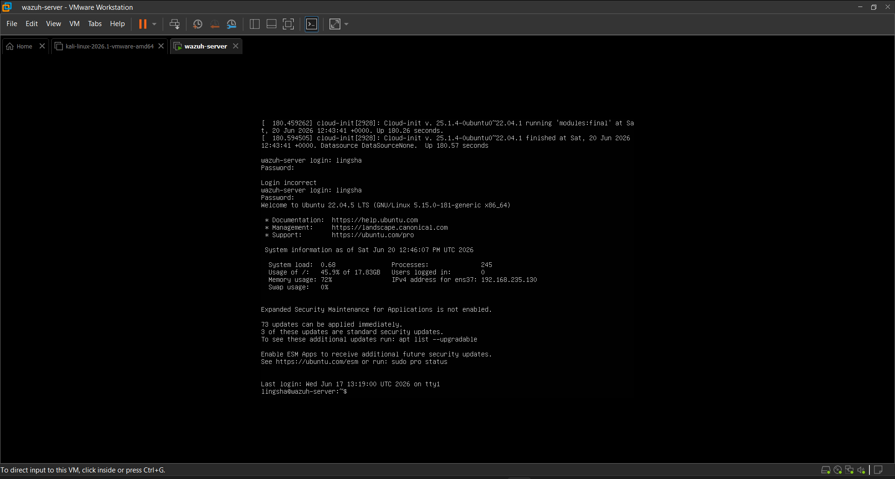
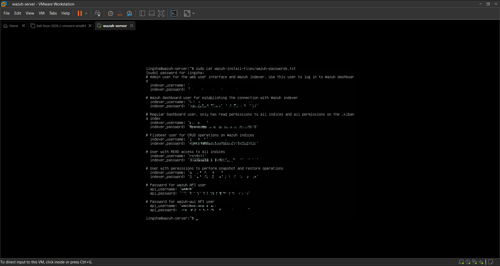
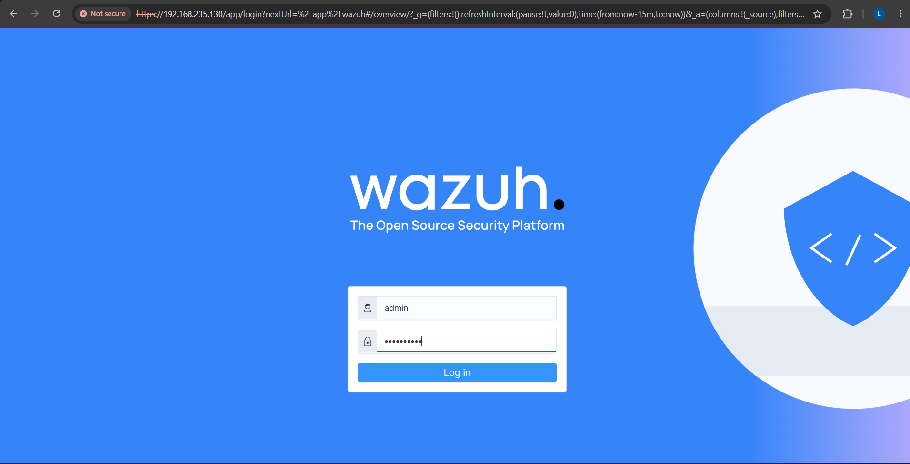
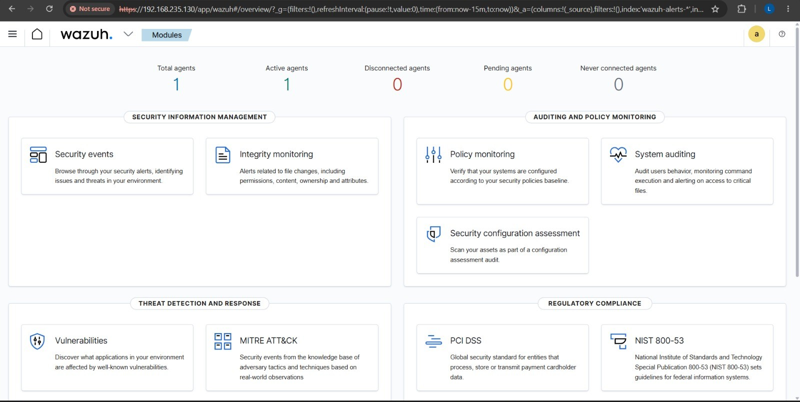
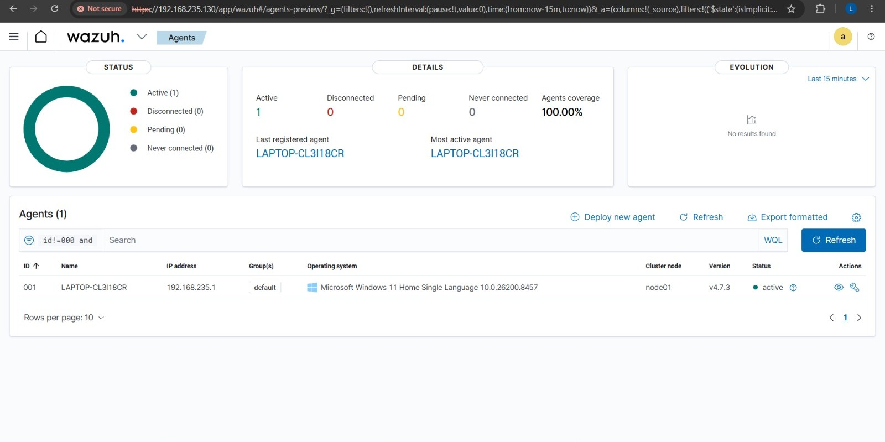
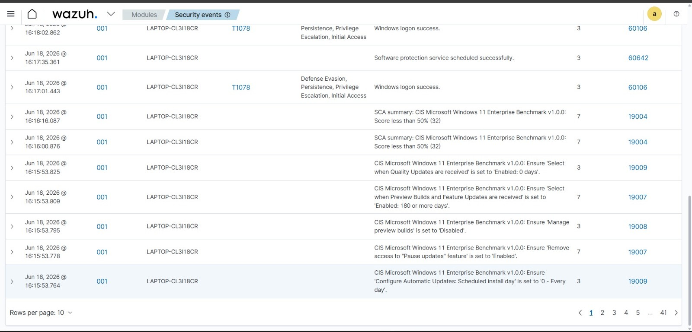

# Wazuh SIEM Home Lab

## Project Overview
This project demonstrates the deployment of Wazuh Siem Home Lab using VMware Workstation, Ubuntu Server 22.04 LTS, and Windows 11.
The goal is to understand how the security operations(SOC) collects logs, detects suspicious activities, generates alerts, and monitors endpoints in a centralized dashboard.

## Objectives
- Learn SIEM fundamentals
- Deploy Wazuh from scratch
- Connect a Windows Agent
- Monitor logs
- Detect security events
- Understand the SOC workflow

## Project Architecture
Windows 11
    │
    ▼
Wazuh Agent
    │
    ▼
Wazuh Manager
    │
    ▼
Wazuh Indexer
    │
    ▼
Wazuh Dashboard

## Technologies Used
- VMware Workstation
- Ubuntu Server 22.04 LTS
- Windows 11
- Wazuh 4.7
- Linux
- OpenSearch

## Installation Steps
### Step 1 - Install VMware Workstation
- Downloaded and installed VMware Workstation on Windows 11.
- VMware Workstation was used to create a virtual machine for running Ubuntu Server safely without affecting the host operating system.

### Step 2 – Create Ubuntu Server Virtual Machine
- Opened VMware Workstation.
- Clicked **Create a New Virtual Machine**.
- Selected the Ubuntu Server 22.04 LTS ISO file.
- Created a new virtual machine.
- Allocated 6 GB RAM, 2 CPU cores, and 50 GB of disk space.
- Configured the network adapter as NAT.
- Powered on the virtual machine and verified Ubuntu booted successfully.

### Step 3 – Install Ubuntu Server 22.04 LTS
- Started the Ubuntu Server virtual machine.
- Selected the language and keyboard layout.
- Configured the network settings.
- Created the hostname, username, and password.
- Completed the Ubuntu Server 22.04 LTS installation.
- Logged in successfully and verified the installation.

### Step 4 – Configure Network
- Checked the network interface using ip a.
- Configured the network adapter as NAT.
- Obtained an IP address using DHCP.
- Verified internet connectivity using the ping command.

### Step 5 – Install Wazuh
- Downloaded the Wazuh installation script.
- Installed Wazuh Manager, Wazuh Indexer, and Wazuh Dashboard.
- Waited for the installation to complete successfully.
- Verified that all Wazuh services were running.

### Step 6 – Access the Wazuh Dashboard
- Opened the Wazuh Dashboard using the Ubuntu Server IP address.
- Logged in with the administrator credentials.
- Verified that the dashboard opened successfully.

### Step 7 – Install the Windows Agent
- Downloaded and installed the Wazuh Agent on Windows 11.
- Entered the Wazuh Manager IP address.
- Started the Wazuh Agent service.
- Confirmed the agent was connected successfully.

### Step 8 – Verify the Agent
- Opened the Wazuh Dashboard.
- Navigated to the Agents section.
- Confirmed the Windows Agent status was Active.

### Step 9 – Monitor Security Events
- Opened the Security Events module.
- Verified that Windows security logs were collected.
- Observed alerts generated by Wazuh.
- Confirmed successful log collection and monitoring.

### 1. Ubuntu Virtual Machine

### 2. Wazuh Installation

### 3. Dashboard Login

### 4. Dashboard Overview

### 5. Active Agent

### 6. Security Events

## Challenges Faced
- Network connectivity issue in the Ubuntu virtual machine.
- Wazuh Indexer failed to start because of low RAM.
- Dashboard connectivity issues.
- Windows Agent registration and connection.

## Solutions
- Configured the network adapter as NAT.
- Increased the virtual machine memory from 3 GB to 6 GB.
- Restarted Wazuh services after configuration.
- Verified the Windows Agent status in the dashboard.

## Skills Learned
- SIEM Fundamentals
- Wazuh Deployment
- Ubuntu Linux Administration
- VMware Workstation
- Windows Agent Configuration
- Log Monitoring
- Security Event Analysis
- Basic Troubleshooting

## Future Improvements
- Add Sysmon for advanced Windows logging.
- Simulate brute-force attacks.
- Connect multiple Windows endpoints.
- Perform incident response exercises.

## Author
Lingsha Shami

Aspiring SOC Analyst

GitHub: https://github.com/Lingshashami

LinkedIn: https://www.linkedin.com/in/lingshashami08/

 
 
